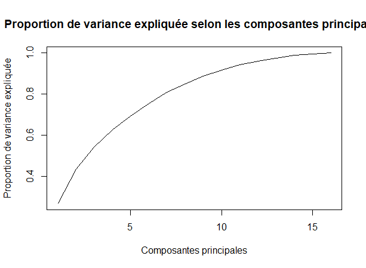
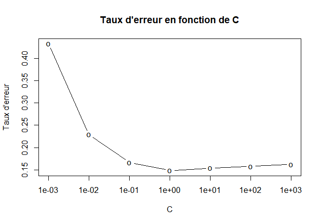
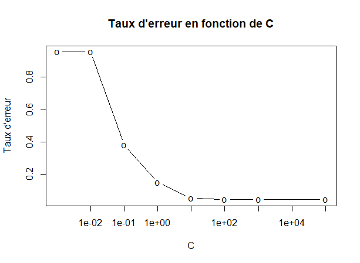
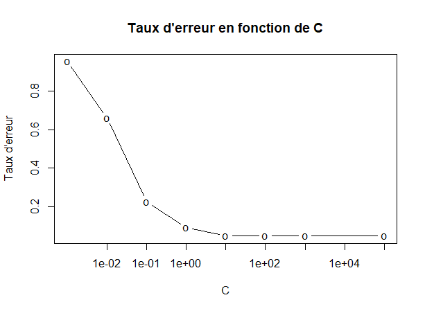
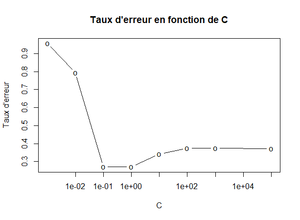
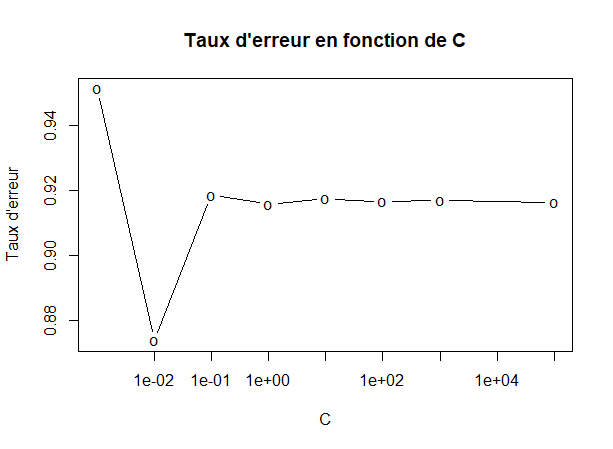

```{r setup, include=FALSE}
knitr::opts_chunk$set(echo = TRUE)
```

# Letter recognition

L'objectif est d'identifier à partir d'un grand nombre de pixels rectangulaires en noir et blanc l'une des 26 lettres majuscules de l'alphabet anglais.

## Analyse exploratoire

Letter recognition est aussi un problème de classification puisqu'il s'agit de prédire une lettre parmi les lettres de l'alphabet. Les fréquences des lettres sont assez bien réparties. 

### Analyse des données

* table classique
* pas de dimension temporelle *connue*
* Nombre d’observations : 10 000
* Nombre de variables : 16 prédicteurs + 1 variables à prédire
* variables connues : X1 à X16
* variable à prédire : y
* aucune Valeurs manquantes
* variables continues : X1 à X16
* variables discrètes : y dans [1;26]

### Analyse des prédicteurs

En premier lieux on regarde si il existe de possible correlation entre les prédicteurs.

{width=30%} 
{width=30%} 
Il ne semble pas y avoir de liens évidents qui nous permettrais d'éliminer certaines variables.

## Sélection de variables

Au vu du faible nombre de prédicteurs, il ne semble pas nécessaire d'appliquer des méthodes de sélection de variables. 
Cependant il est toujours intéressant de diminuer la dimensionalité si cela est possible et permet d'améliorer les résultat de notre classification.

L'ACP semble être une mauvaise idée. En effet pour obtenir une explication de la vartiance superieur proche de 100% il faut utiliser l'enssemble des prédicteurs. Il n'y à pas un "gap" qui permette avec un sous enssrmble de composantes d'expliquer une grande proportion de la variance.

{width=53%} 

Une autrre idée est de sélectionner les variables qui ont la plus grande importance dans le modèle de la randomForest.

{width=53%} 
Cette idée est notament renforcé par le fait que les modèle basé sur la forête aléatoire se trouvent être les plus performants (entre 2% et 3% de taux d'erreur).

Enfin nous testons les modèle de sélection de variable ridge et lasso. Mais ceux-ci ne ^résentent pas de très bonne performance (relativement aux autres méthodes testers). Ce qui conforte l'idée qu'une sélection de variable ne semble pas être ici très pertinente.

## Entraînement des modèles

Nous appliquons les algorithmes de classifications suivants : Naive Bayes (NB), K plus proches voisins (KNN), Analyse Discriminante Linéaire (LDA), Analyse Discriminante Quadratique (QDA), Analyse Discriminante Factorielle (FDA), Régression Logistique (RL), Ridge, Lasso, arbre de classfication (TREE), arbre de classification élagué (pTREE), Bagging, Forêt Aléatoire (RF), Forêt Aléatoire avec recherche du paramètre optimal mtry, mélange aléatoire gaussien (GMM), mélange aléatoire gaussien avec analyse discriminante (GMM_EDDA), séparateur à Vaste Marge (KSVM) avec plusieurs noyaux, résaux de neurone. 

Ces algorithmes sont dans un premiers temps tester avec l'ensssemble des prédicteurs. Cette première étude nous permet de voir si des modèle se distingue déjà fortement des autres, ce qui nous permettra une étude aprofondie. 

Pour chaque modèle, nous réalisons une validation croisée à 10 plis. Pour certains classifieurs nécessitant de spécifier un hyperparamètre, nous utilisons une validation croisée imbriquée pour obtenir l'hyperparamètre optimal. 


|     **Modèle**     |   KNN  | Ridge | Lasso | Elastic Net | RF | SVM |
|--------------|:------:|:-----:|:-------:|:-------------:|:----:|:-----:|
| **Hyperparamètre** | K = 22 | $\bar{\lambda}$ = 0.033 | $\bar{\lambda}$ = 0.00072 | $\bar{\lambda}$ = 0.00663, $\bar{\alpha}$ = 1 |  $\lambda$ = 20  |  C = 1   |
Table: Valeur des hyperparamètres optimaux pour chaque modèle

### packages

### KSVM

Au cours de nos tests, nous essayons d'appliquer le modèle de sépoarateur à vaste marge avec le noyaux "Radial Basis Function". Pour ce faire oncalcul dans un premier temps l'erreur que l'on obtients pour différentes valeurs de C : 0.001, 0.01, 1, 10, 100, 1 000, 100 000. On s'apérçois alors de l'éfficacité du modèle qui à une erreur miniamle pour C = 10 de 4,7%.
Ce résultats très encourageant aux vues des performances des autres modèles (seul les modèles de forêt aléatoire font mieux), nous pousse à approfondire nos recherche sur ce type de solution.
Ainsi pour chaque type de noyaux nous essyons de déterminer le taux d'erreur en fonction de l'hyperparamètre C.

{width=20%} 

{width=20%}

{width=20%}

{width=20%}

{width=20%}


|     **Noyaux**     | RBF | Laplace | Bessel | polynome | tanh |
|--------------------|:------:|:-----:|:-----:|:-----:|:-----:|
| **taux d'erreur miniaml** | 0.423 | 0.0445 | 0.269 | 0.1484 | > 0.8 |
| **C correspondant** | 100 | 10 | 0.1 | 1 | 0.01 |
Table: Valeur des hyperparamètres optimaux pour chaque modèle

On constate que les deux modèle qui se distingue des autres par leurs bonne performance sont ceux qui utilisent le noyau "Laplace" ainsi que le noyau "Radial Basis fuinction". Il est normale que ces deux modèle ai des résultats très proche car les fonction de noyaux sont similaire. 
Ainsi KSVM donne de très bonne performance de 4.42% de taux d'erreur avec le noyaux "Laplace".

Enfin puisque le modèle de séparateur à vaste marge se distingue des autres pour ces deux noyaux, nous aprofondissons nos recherche en essayant d'appliquer une sélection de variable en returant celle qui sont moins important aux sens de la forêt aléatoire. Cependdant o,n constate que chaque prédicteurs enlevé augment le taux d'erreurs, continuant de nous convaicnre de la non pertinence d'une séléction de variable.

## Résultats

Après avoir testé tous les modèles, nous obtenons la figure ci-dessous résumant le taux d'erreur selon chaque modèle. Nous constatons que les modèles sont globalement plutôt performants avec des écart-types inégaux mais relativement faibles. 
En effet étant donné qu'il y a 26 classe, le taux d'erreur d'une classification aléatoire est de 25/26 et ici, le pire modèle à un taux d'erreur inferieur à 50%.


|     **Modèle**     | LDA | QDA | FDA | NB | KNN | Ridge | Lasso | TREE | pTREE |  mtry | SVM RBF | SVM Laplace |
|--------------|:------:|:-----:|:-------:|:-------------:|:----:|:-----:|:-----:|
| **Taux d'erreur** | K = 22 | $\bar{\lambda}$ = 0.033 | $\bar{\lambda}$ = 0.00072 | $\bar{\lambda}$ = 0.00663, $\bar{\alpha}$ = 1 |  $\lambda$ = 20  |  C = 10   | C = 100 |
Table: Erreur moyenne de la validation croisé pour chaque modèle

Les modèles basé sur les separateurs à vste marge, précédé par les modèle de forête aléatoie semble particulièrement performant (moins de 5% de taux d'erreurs). De plus ces modèles sont ceux qui présentes les variuances les plus faible. Enfin au vue de la grande différence des taux d'erreur observé suivant ces modèle, ce critère semble suffisament pertinent pour distingué les modèles.

Ainsi, en conclusion, nous choisissons le modèle de la **forêt aléatoire avec mtry = 6**. 