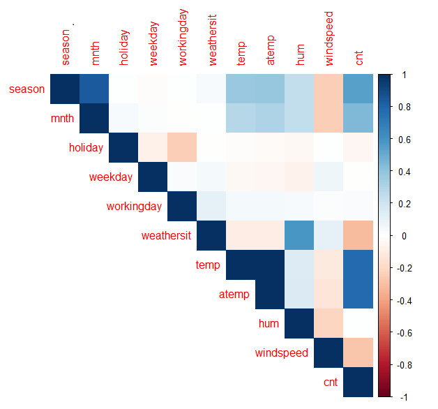

```{r setup, include=FALSE}
knitr::opts_chunk$set(echo = TRUE)
```

# Introduction

Ce rapport a pour but de présenter nos démarches pour construire des fonctions de prédiction les plus performantes possibles pour les trois jeux de données étudiés. Pour chacun d'entre eux, nous avons réalisé une analyse exploratoire pour avoir une première connaissance des données. Puis, nous avons utilisé les méthodes d'apprentissage vues en cours, avec dans certains cas l'utilisation de variables sélectionnées par différentes méthodes afin d'améliorer les résultats.

# Phonemes

## Analyse exploratoire

Le jeu de données `Phonèmes` peut être traité comme un problème de classification avec cinq classes. Les fréquences de chaque phonème sont assez équitablement réparties. Nous représentons le log-periodogram sur la Figure 1. On observe que les phonèmes `dcl` et `sh` sont assez différents mais pour les autres phonèmes, leur log-periodogram est assez similaire.

{width=45%} 


## Sélection de variables

Au vu du grand nombre de variables, nous décidons d'appliquer des méthodes de sélection de variables. 
Les variables étant les longueurs des log-periodograms, il ne serait pas pertinent d'utiliser des méthodes telles que les forward/backward subset selection ou de récupérer les variables les plus importantes mesurées par une forêt aléatoire. En effet, cela n'aurait pas de sens de sélectionner seulement certaines fréquences puis de réaliser une classification sur ces dernières. Cependant, nous pouvons chercher à réduire le nombre de variables tout en conservant le maximum d'information, en transformant notamment les variables. Nous décidons alors d'appliquer une Analyse en Composantes Principales (ACP). Nous obtenons la Figure 2 montrant le pourcentage de variances expliquées selon les composantes principales : 

{width=53%} 

Ainsi, les 50 premières composantes principales expliquent environ 91.04% de la variance. Nous décidons donc de garder les 50 premières composantes principales. Nous aurions également pu appliquer une validation croisée pour obtenir le nombre de composantes principales optimal. Cependant, étant donné qu'augmenter de 50 composantes de plus nous permet de gagner environ 3.5% et qu'en retirant un trop grand nombre de composantes, les performances sont réduites de manière trop drastique, nous décidons de garder ces 50 premières composantes principales. Nous n'aurons pas la place d'illustrer nos résultats avec toutes les données sans l'ACP mais il s'avère que pour la majorité des modèles, les résultats sont au moins aussi bons ou pires (en particulier pour la QDA qui approche les 30% d'erreurs).

## Entraînement des modèles

Nous appliquons les algorithmes de classification suivants : Naive Bayes (NB), K plus proches voisins (KNN), Analyse Discriminante Linéaire (LDA), Analyse Discriminante Quadratique (QDA), Analyse Discriminante Factorielle (FDA), Analyse Discriminante Régularisée (RDA), Régression Logistique (RL), Ridge, Lasso et Elastic Net, Bagging, Forêt Aléatoire (RF), Modèle de Mélange Gaussien (GMM),  Mixture Discriminant Analysis (MDA) et Séparateur à Vaste Marge (SVM) avec trois noyaux différents (linéaire, polynomial et à fonctions de base radiale). 

Pour chaque modèle, nous réalisons une validation croisée à 10 plis. Pour certains classifieurs nécessitant de spécifier un hyperparamètre, nous utilisons une validation croisée imbriquée pour obtenir l'hyperparamètre optimal. Le code suivant décrit la manière dont les validations croisées ont été réalisées : 

```{r eval=FALSE}
library(caret)
CV <- rep(0,10)
#Creating folds
fold <- unname(createFolds(data$y, k=10))
for(i in (1:10)){
  #Training data
  train_data <- data[-fold[[i]], ]
  #Creating test data
  test_data <- data[fold[[i]], ]
  
  #PCA
  ## train set
  pca <- princomp(scale(train_data[, 1:256]))
  U <- pca$loadings
  train_data <- cbind.data.frame(pca$scores[,1:50], train_data$y)
  names(train_data)[ncol(train_data)] <- "y"
  ## test set
  X <- scale(as.matrix(test_data[, 1:256]))
  C <- X %*% U[, 1:50]
  test_data <- cbind.data.frame(C, test_data$y)
  names(test_data)[ncol(test_data)] <- "y"

  X.train <- train_data[,1:50]
  y.train <- train_data[, 51]
  X.test <- as.matrix(test_data[,1:50])
  y.test <- test_data[, 51]

  model <- classifieur(X.train, y.train)
  pred <- predict(model, X.test)

  CV[i] <- 1-sum(diag(table(y.test,pred)))/nrow(X.test)
  
  # errors est une matrice (10, n) avec n le nombre de classifieurs
  errors[i, c("Classifieur")] <- CV[i]
}
```

Nous résumons dans la Table 1 le(s) hyperparamètre(s) pour chaque modèle. Les hyperparamètres pour Ridge, Lasso et Elastic Net n'ont pas nécessité d'être déterminés avec une validation croisée imbriquée mais directement avec la fonction `cv.glmnet`. Quant au RDA, ils ont été obtenus avec la méthode `train` de la librairie `caret`. Ainsi, nous écrivons la médiane des hyperparamètres obtenus lors des validations croisées à 10 plis. Quant au SVM, son hyperparamètre a été obtenu en faisant une validation croisée parmi les valeurs de C suivantes : 0.001,0.01,0.1,1,10,100,1000,$10^4$. 

|     **Modèle**     |   KNN  | Ridge | Lasso | Elastic Net | RF | SVM-rbf | RDA |
|------------|:-----:|:-----:|:-------:|:--------:|:----:|:-----:|:-----:|
| **Hyperparamètre** | K = 22 | $\bar{\lambda}$ = 0.033 | $\bar{\lambda}$ = 0.00086 | $\bar{\lambda}$ = 0.00660, $\bar{\alpha}$ = 1 |  $\lambda$ = 20  |  C = 1   | $\bar{\lambda}$ = 0.83, $\bar{\alpha}$ = 0.29 |
Table: Valeur des hyperparamètres optimaux pour chaque modèle

Pour les GMM, nous avons utilisé la librairie `Mclust` et cette dernière a sélectionné le modèle "VVE" (ellipsoïdal, à volume et forme variants et orientation égale) à 6 composants comme étant optimal en utilisant le critère BIC. Par conséquent, nous avons utilisé ce même modèle pour entraîner notre MDA. Pour cette dernière, nous avons différencié le cas où les modèles doivent avoir un nombre de mélanges de composants et des structures de covariance (eg. des modèles sur les matrices de covariance) différents pour chaque classe (MDA) du cas où un seul composant est considéré avec la même structure de covariance pour toutes les classes (MDA_EDDA) à la manière du LDA, grâce à l'argument `modelType`. En utilisant la librairie `cvMclustDA`, une validation croisée à 10 plis a pu être réalisée directement, c'est pourquoi il n'y a pas d'intervalles de confiance sur la Figure 3. Dans le code ci-dessous, `phonemes_pc` dénote le jeu de données après application de l'ACP.


```{r eval=FALSE}
# CV MDA with VVE
phonemes_gmm_VVE <- MclustDA(phonemes_pc[,1:50], phonemes_pc$y, modelNames="VVE")
cv <- cvMclustDA(phonemes_gmm_VVE)
errors[, c("MDA")] <- 1 - sum(diag(table(cv$classification, factor(phonemes$y))))/nrow(phonemes_pc)

# CV MDA with VVE and EDDA (LDA)
phonemes_gmm_VVE_EDDA <- MclustDA(phonemes_pc[,1:50], phonemes_pc$y, modelType = "EDDA",
                                  modelNames="VVE")
cv <- cvMclustDA(phonemes_gmm_VVE_EDDA)
errors[, c("MDA_EDDA")] <- 1 - sum(diag(table(cv$classification, factor(phonemes$y))))/
  nrow(phonemes_pc)
```

## Résultats

Après avoir testé tous les modèles, nous obtenons la Figure 3 résumant le pourcentage d'erreur selon chaque modèle. Nous constatons que les modèles sont globalement performants avec des écart-types relativement faibles; le moins bon modèle ayant une erreur moyenne de moins de 15%.

{width=60%}

Nous constatons que les modèles les moins performants à l'apprentissage sont l'arbre de décision (DT) et l'arbre avec élagage (DT_pruned). Cependant, en utilisant les méthodes ensemblistes avec le Bagging et les forêts aléatoires, nous parvenons à améliorer les résultats. Quant aux GAM, l'apprentissage n'a été réalisé qu'avec des splines sur les trois premières composantes principales, ce qui explique en partie des résultats moins bons.

Les méthodes basées sur l'analyse discriminante donnent globalement de bons résultats. En supposant que les matrices de covariance sont égales pour chaque classe, on obtient de meilleurs résultats. C'est pourquoi LDA, FDA et RDA ont de meilleures performances que QDA. En particulier, RDA est le plus performant, ce qui est cohérent au vu des hyperparamètres obtenus par validation croisée. En effet, on a obtenu des valeurs de $\lambda$ proches de 1 tandis que celles de $\gamma$ étaient assez faibles. Par conséquent, les matrices de covariance régularisées sont similaires aux estimations des matrices de covariance égales, telles qu'utilisées par la LDA. 

Le SVM avec différents noyaux donnent de bons résultats. Les méthodes avec régularisation sont encore meilleures, notamment avec le lasso. Toutefois, comme évoqué dans la sélection de variables, il faut être vigilant avec ces méthodes car elles ne semblent pas être efficaces avec notre jeu de données.

Ainsi, en conclusion, nous choisissons la **RDA** avec les paramètres $\lambda$ = 0.83 et $\alpha$ = 0.29.

# Letter recognition

L'objectif est d'identifier à partir d'un grand nombre de pixels rectangulaires en noir et blanc l'une des 26 lettres majuscules de l'alphabet anglais.

## Analyse exploratoire

Letter recognition est aussi un problème de classification puisqu'il s'agit de prédire une lettre parmi les lettres de l'alphabet. Les fréquences des lettres sont assez bien réparties. 

### Analyse des données

En faisant une analyse rapide du jeu de données, nous obtenons les caractéristiques :

* Pas de dimension temporelle *connue*
* Nombre d’observations : 10 000
* Nombre de variables : 16 prédicteurs + 1 variable à prédire
* Variables connues : X1 à X16
* Variable à prédire : y
* Aucune valeur manquante
* Variables continues : X1 à X16
* Variable discrète : y $\in$ [1, 26]

### Analyse des prédicteurs

En premier lieu, on regarde s'il existe de possibles correlations entre les prédicteurs.

{width=50%} 
{width=50%} 

A priori, il ne semble pas y avoir de liens évidents qui nous permettraient d'éliminer certaines variables, hormis entre X3 et X4, et X12 et X13 qui semblent suivre une tendance linéaire.

## Sélection de variables

Au vu du faible nombre de prédicteurs, il ne semble pas nécessaire d'appliquer des méthodes de sélection de variables. Cependant il est toujours intéressant de diminuer la dimensionalité si cela est possible et permet d'améliorer les résultats de notre classification. L'ACP semble être une mauvaise idée. En effet pour obtenir une explication de la variance supérieure proche de 100% il faut utiliser l'ensemble des prédicteurs. Il n'y a pas un "gap" qui permette, avec un sous-ensemble de composantes, d'expliquer une grande proportion de la variance. Une autre idée est de sélectionner les variables qui ont la plus grande importance en utilisant l'importance des variables avec la méthode des forêts aléatoires.

{width=50%} 

Cette idée est notamment renforcée par le fait que les modèles basés sur la forêt aléatoire se trouvent être les plus performants (entre 2% et 3% de taux d'erreur). Enfin nous testons les modèle de sélection de variables ridge et lasso. Ceux-ci ne présentent pas de très bonnes performances (relativement aux autres méthodes testées). Cela conforte l'idée qu'une sélection de variables ne semble pas être très pertinente ici.

## Entraînement des modèles

Nous appliquons les algorithmes de classification suivants : Naive Bayes (NB), K plus proches voisins (KNN), Analyse Discriminante Linéaire (LDA), Analyse Discriminante Quadratique (QDA), Analyse Discriminante Factorielle (FDA), Régression Logistique (RL), Ridge, Lasso, arbre de classfication (TREE), arbre de classification élagué (pTREE), Bagging, Forêt Aléatoire (RF), Forêt Aléatoire avec recherche du paramètre optimal mtry, Mélange Aléatoire Gaussien (GMM), Mélange Aléatoire Gaussien avec Analyse Discriminante (GMM_EDDA), Séparateur à Vaste Marge (KSVM) avec plusieurs noyaux et les réseaux de neurones (nn). 

Le réseau de neurones à été genéré grâce au package `nnet` de la façon suivante :
```{r eval=FALSE}
nnet(as.factor(Y) ~ ., data=train_data, size=5, linout = TRUE)
```
Les mauvais résultats (relatifs) ne nous pousseront pas à approfondir ce modèle.

Les arbres ont été créés via la fonction `rpart` avec l'indice de gini. Pour ce qui est de l'arbre élagué nous avons utilisé la fonction `prune`.
```{r eval=FALSE}
  fit <- rpart(Y ~ ., data = train_data, method="class", parms = list(split = 'gini'))
  pruned_tree<-prune(fit,cp=fit$cptable[which.min(fit$cptable[,"xerror"]),"CP"])
```


Ici Bagging prend comme paramètre `mtry = 16` (le nombre de prédicteurs), forêt aléatoire prend comme paramètre `mtry = 4` (racine carrée du nombre de prédicteurs). Enfin, grâce à la fonction `tuneRF` de la librarie `randomForest`, on recherche le paramètre  `mtry` optimal.

```{r eval=FALSE}
tuneRF(data_class.train[,2:17], data_class.train$Y, stepFactor=1.5, improve=1e-5, ntree=500)
```

Dans un premier temps, ces algorithmes sont testés avec l'ensemble des prédicteurs. Cette première étude nous permet de voir si des modèles se distinguent déjà fortement des autres, ce qui nous permettra de réaliser une étude approfondie. 

Pour chaque modèle, nous réalisons une validation croisée à 10 plis. Pour certains classifieurs nécessitant de spécifier un hyperparamètre, nous utilisons une validation croisée imbriquée pour obtenir l'hyperparamètre optimal. 


|     **Modèle**     |   KNN  | Ridge | Lasso | RF mtry |
|----------|:------:|:-----:|:-----:|:-----:|
| **Hyperparamètre** | K = 1 | $\bar{\lambda}$ = 0.008674308 | $\bar{\lambda}$ = 8.615844e-05 | mtry = 2.9 (en moyenne) |
Table: Valeur des hyperparamètres optimaux pour chaque modèle

### KSVM

Au cours de nos tests, nous essayons d'appliquer un SVM avec le noyau "Radial Basis Function". Pour ce faire, on calcule l'erreur obtenue pour différentes valeurs de C : 0.001, 0.01, 1, 10, 100, 1 000, 100 000. On s'aperçoit alors de l'efficacité du modèle qui a une erreur minimale de 4,7% pour $C = 10$.
Ce résultat très encourageant au vu des performances des autres modèles (seuls les modèles de forêt aléatoire font mieux), nous pousse à approfondir nos recherches sur ce type de solution.
Ainsi pour chaque type de noyaux, nous essayons de déterminer le taux d'erreur en fonction de l'hyperparamètre C.

|     **Noyaux**     | RBF | Laplace | Bessel | polynome | tanh |
|--------------------|:------:|:-----:|:-----:|:-----:|:-----:|
| **taux d'erreur minimal** | 0.423 | 0.0445 | 0.269 | 0.1484 | > 0.8 |
| **C correspondant** | 100 | 10 | 0.1 | 1 | 0.01 |
Table: Valeur des hyperparamètres optimaux pour chaque noyau du SVM

On constate que les deux modèles qui se distinguent des autres par leur bonne performance sont ceux qui utilisent le noyau "Laplace" ainsi que le noyau "Radial Basis Function". Il est normal que ces deux modèles aient des résultats très proches car les fonctions de noyaux sont similaires. 
Ainsi KSVM donne de très bonnes performances de 4.42% de taux d'erreur avec le noyau "Laplace".

Enfin puisque le SVM se distingue des autres pour ces deux noyaux, nous approfondissons nos recherches en essayant d'appliquer une sélection de variables en retirant celles qui sont moins importantes au sens de la forêt aléatoire. Cependant on constate que chaque prédicteur enlevé augmente le taux d'erreur.

## Résultats

Après avoir testé tous les modèles, nous obtenons la figure 5 résumant le taux d'erreur selon chaque modèle. Nous constatons que les modèles sont globalement performants avec des écart-types inégaux mais relativement faibles. 
En effet étant donné qu'il y a 26 classes, le taux d'erreur d'une classification aléatoire est de 25/26 et ici, le pire modèle à un taux d'erreur inférieur à 50%.

{width=75%}

Les pires modèles sont l'arbre et l'arbre élagué (qui en fait ici est toujours le même arbre). Ensuite le modèle avec le moins bon taux d'erreur est le réseau de neurones. Cela n'est pas surprenant car un réseau de neurones performe une transformation de l'espace des prédicteurs. Or ici, les prédicteurs sont relativement peu nombreux et représente déjà une tranformation des informations initiales (les images de lettres).

A contrario, les modèles basés sur les SVM, précédés par les modèles de forêt aléatoire semblent particulièrement performants (moins de 5% de taux d'erreur). De plus ces modèles sont ceux qui présentent les variances les plus faibles. Enfin, au vu de la grande différence des taux d'erreur observés suivant ces modèles, ce critère semble suffisamment pertinent pour distinguer les modèles.

|     **Meilleurs modèles**     | RF mtry | RF | Bagging | SVM_rbf | SVM_laplace |
|--------------------|:------:|:-----:|:-----:|:-----:|:-----:|
| **Taux d'erreur** | 0.01810013 | 0.02550019 | 0.02599946 | 0.04550196  | 0.04550196 |
Table: taux d'erreur moyen (validation croisée à 10 plis)

Ainsi, en conclusion, nous choisissons le modèle de la **forêt aléatoire avec mtry = 3**. 


# Bike rental

## Analyse  exploratoire

Bike rental est cette fois un problème de régression dans lequel il faut prédire le nombre de locations de vélos sur l'année 2012 selon les conditions environnementales et saisonnières. Il y a à la fois des variables qualitatives et quantitatives. Tout d'abord, nous observons que la variable `yr` vaut toujours 0 peut importe l'observation, donc toutes les données ont bien été recueillies sur l'année 2011 et nous décidons alors d'enlever cette variable. La variable `instant` correspond simplement aux index relevés, c'est pourquoi nous décidons de la retirer également. 

Nous avons analysé les tendances selon les mois, saisons, semaines et s'il s'agissait d'une période de vacances ou non. Par exemple, nous observons qu'il y a visiblement plus de locations en printemps et été qu'en automne et hiver. Cela nous permet d'avoir une première vision sur les variables. Cependant, le fait que les données soient issues d'une seule année ne permet pas de conclure sur l'existence d'éventuelles séries temporelles. 

Par la suite, nous étudions le corrélogramme avec les commandes suivantes :
```{r eval=FALSE}
library(corrplot)
matCor <- cor(bike)
corrplot(matCor, type="upper", method ="color" )
```

{width=45%} 
{width=55%}

Comme nous pouvions l'imaginer, certaines variables sont fortement corrélées (**temp** et **atemp**,  **season** et **mnth**). On peut aussi remarquer que les variables qui mesurent la température sont positivement corrélées avec le nombre de locations, ce qui se traduit par un plus grand nombre de locations lorsqu'il fait chaud. La variable *wheathersit* est également corrélée négativement avec le nombre de locations, ce qui se traduit par un nombre de locations plus élevé lorsque *wheatersit* est faible (1 : Ciel dégagé, peu nuagueux). 

Une ACP confirme l'existence d'un sous-ensemble de predicteurs significatifs puisque nous pouvons remarquer que 6 prédicteurs suffisent à expliquer 80% de la variance expliquée, et au-delà de 6 predicteurs la courbe s'aplatit. Nous pourrions enlever au préalable les variables qui sont manifestement redondantes ou réaliser des prédictions à partir des résultats de l'ACP. Au lieu de cela nous allons laisser le jeu de données dans l'état et laisser la fonction `regsubset` sélectionner les prédicteurs les plus significatifs. 


## Sélection du meilleur modèle
```{r eval=FALSE}
library(leaps)

leaps <- regsubsets(bike$cnt~. , data=bike, method='forward', nvmax=10)
```
{width=60%} 

Grâce au package **leaps** nous réalisons une recherche des meilleurs sous-ensemble de prédicteurs de taille inférieure ou égale à 10 (les méthodes **forward** et **backward** donnent des résultats presque identiques). Les critères classiques de séléction du meilleur sous-ensemble ne permettent pas de conclure immédiatement quant à la taille optimale du sous-ensemble de prédicteurs. En raison de la taille modérée du jeu de données, nous avons opté pour une recherche plus exhaustive. Nous avons réalisé des fonctions permettant de générer du code dynamiquement à l'interieur d'une boucle de façon à tester une série de modèles differents, pour chaque modèle la boucle teste tous les sous-ensembles de 1 à 10 prédicteurs, et pour chaque sous-ensemble de chaque modèle la boucle teste une série d'hyperparamètres spécifiques au modèle en question. Pour chaque test nous réalisons aussi une validation croisée avec 5 plis, réeptée 10 fois. A l'issue de cette recherche nous obtenons les performances de chaque modèle testé, dans les conditions optimales (sous-ensembles de prédicteurs optimales et hyperparamètres optimaux). Le temps de compilation est élevé mais en raison de la taille du jeu de données, cette démarche reste réalisable en un temps raisonnable.

```{r eval=FALSE}
get_model_formula <- function(id, object, outcome){
  models <- summary(object)$which[id,-1]
  predictors <- names(which(models == TRUE))
  predictors <- paste(predictors, collapse = "+")
  as.formula(paste0(outcome, "~", predictors))
}
```

La fonction `get_model_formula` permet de générer dynamiquement la formule à injecter dans les modèles. Le package `caret` permet de réaliser des validations croisées avec un code très compact, ce package permet aussi de tester differentes valeurs des hyperparametres spécifiques aux modèles avec le paramètre `tuneLength`. Nous réalisons une recherche sur 12 modèles differents : régression linéaire (lm), K plus proches voisins (knn), séparateur à vaste marge avec kernel linéaire, radial et polynomial (svm.line, svm.rad, svm.poly), ridge, lasso, gam, arbre de régression (reg.tree), arbre avec bagging (bag.tree), arbre avec amplification du gradient (boost.tree), forêt aléatoire (rndm.forest).

```{r eval=FALSE}
library(Rcpp)
.
.
library(caret)

model.ids <- 1:10
train.control <- trainControl(method = "repeatedcv", number = 5,  repeats = 10)
models.list <- c("lm", "knn", "svm.line", "svm.rad", "svm.poly","ridge", "lasso",
                 "gam", "bag.tree", "boost.tree", "rndm.forest", "reg.tree")

for(model in models.list)
{
  if(model == "lm")
  {
    get_cv_error <- function(model.formula, data){
      cv <- train(model.formula, data = data, "lm",
                  trControl = train.control)
      cv$results$RMSE
    }
  }
  .
  .
  }
  else if(model == "rndm.forest")
  {
    get_cv_error <- function(model.formula, data){
      cv <- train(model.formula, data = data, "cforest",
                  preProcess = c("center","scale"), 
                  trControl = train.control,
                  tuneLength = 10)
      cv$results$RMSE
    }
  }
  else
  {
    class.model <- NULL
  }
  cv.errors <-  map(model.ids, get_model_formula, models, "cnt") %>%
    map(get_cv_error, data = bike) %>%
    unlist()
  
  models.MSE[model] <- min(cv.errors)^2
}
```

Pour ne pas alourdir la rédaction dans le code ci-dessus nous avons remplacé les parties de code peu pertinentes par des "..". Ainsi dans les packages nous avons omis tous les packages nécessaires à l'execution  de chacun des modèles testés (**MASS**, **rpart**, **e1071** pour les SVM, **gam**,..). Nous avons créé une fonction `get_cv_error` spécifique à chaque modèle qui permet de tenir compte des hyperparamètres et des éventuels traitements spécifiques. Enfin `cv.errors` avec la fonction `map` permet d'appliquer la fonction `get_cv_error` à chaque combinaison de sous-ensembles de prédicteurs. Le package `caret` ne permet pas de calculer la MSE directement mais nous pouvons calculer la RMSE et l'élever au carré pour obtenir la MSE.

{width=63%} 

Le package `caret` renvoie directement la médiane des erreurs de validation croisée. On peut voir que le modèle qui donne la MSE le plus faible est le SVM avec le noyau "Radial Basis Function". Toutefois, nous ne savons pas quelle combinaison (nombre de predicteurs et hyperparamètres du modèle) a permis d'obtenir ce resultat. Nous allons donc mener une recherche plus fine sur ce modèle. Voici les résultats obtenus avec les SVM avec le noyau “Radial Basis Function” lors de la recherche du meilleur modèle.

{width=57%}

Dans cette figure nous pouvons observer le processus de recherche. On teste le modèle avec 10 sous-ensembles de prédicteurs (de 1 à 10) et pour chaque sous-ensemble on teste 10 valeurs du paramètre spécifique au modèle dans le cas du SVM avec le noyau "Radial Basis Function" c'est le C (cost). On a donc fait 100 validations croisées pour aboutir au meilleur paramétrage du modèle. La métrique utilisée est toujours la RMSE. On voit qu'il y a 10 paraboles (une par sous-ensemble de predicteurs), chacune constituée de 10 points (un par valeur de C). La valeur de RMSE la plus faible se trouve sur la $10^{ème}$ parabole. Cela signifie que celle-ci a été obtenue avec le sous-ensemble de 10 prédicteurs (tous les prédicteurs). Le modèle avec 5 prédicteurs permet aussi d'atteindre des performances très intéressantes, les 5 prédicteurs en question sont : **season**, **weathersit**, **temp**, **hum** et **windspeed**. Le fait que le meilleur modèle soit celui qui utilise tous les prédicteurs peut être dû à l'overfitting. En effet nous avons accès à des données réprésentatives d'une seule année. L'emploi de ce modèle sur des données issues d'autres années permettrait de lever ce doute. Nous retenons le modèle utilisant 5 prédicteurs.
Nous devons maintenant trouver la valeur de l'hyperparamètre C (Cost) qui a permis d'obtenir ce résultat, pour cela nous pouvons utiliser le package `caret` qui encapsule les valeurs optimales dans la variable `$bestTune`. Nous obtenons que la valeur optimale de C est 2. Une validation croisée plus fine, par pas de 0.1 entre 0 et 6, permet d'obtenir des valeurs autour de 1.5. 
Pour conclure nous pouvons constater que notre modèle est constitué de 5 prédicteurs relatifs à la météo et il est donc très facilement interprétable. Le sujet de ce projet mentionne le fait que le dataset contient les données de 2011 et 2012 or il ne contient que les données de 2011, nous avons donc supposé que les donnés de test seront celle de l'année 2012. Ceci nous a amenés à émettre des hypothèses pour le tests de performance sur la platéforme Maggle. Nous avons considéré que d'une année à l'autre les données relatives à la météo sont peu susceptibles de changer, par contre ce qui risque de varier est le nombre vélos loués à conditions météo égales. Nous avons supposé que la courbe representant les nombre de vélos loués par mois peut être approché par une courbe continue, ainsi nombre de vélos loués au début du mois de janvier 2012 sera proche du nombre de vélos loués en decembre 2011. Nous avons donc calculé une métrique permettant d'éstimer la distance entre le nombre de locations du mois de janvier 2011 et le nombre de locations du mois de décembre. Nous avons chois comme métrique la norme éuclidienne.

```{r eval=FALSE}
jan <- data$cnt[1:31]
dec <- data$cnt[335:365]
norm((jan-dec),"2")/norm(jan,"2")
```
Nous obtenons que cette "distance" vaut 1.46, nous avons donc testé notre modèle le plus prometteur en multipliant la variable **cnt** par des constantes autour de 1.46 avant d'entraîner le modèle. Ceci à permis de diviser le MSE par 7 par rapport à notre modèles initial et semble donc confirmer nos hypotèses. En pratique cela se traduit par le fait que les courbes du nombre vélos loués dans les données d'entraînement et dans les données de test, ont une allure similaire à une constante multiplicative près.


