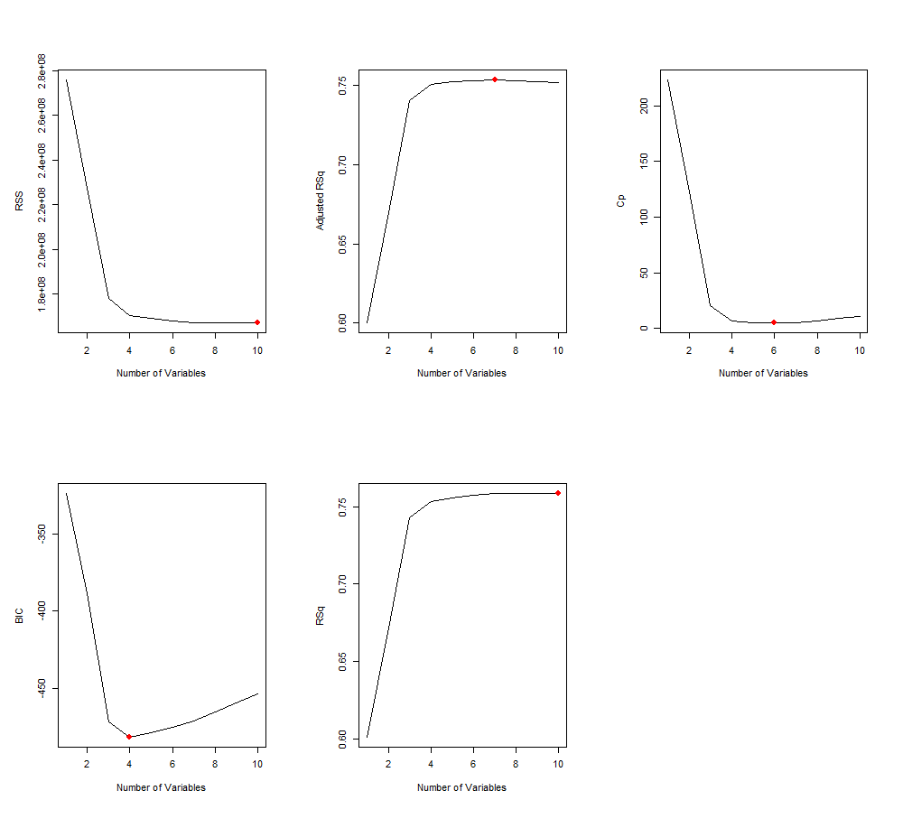
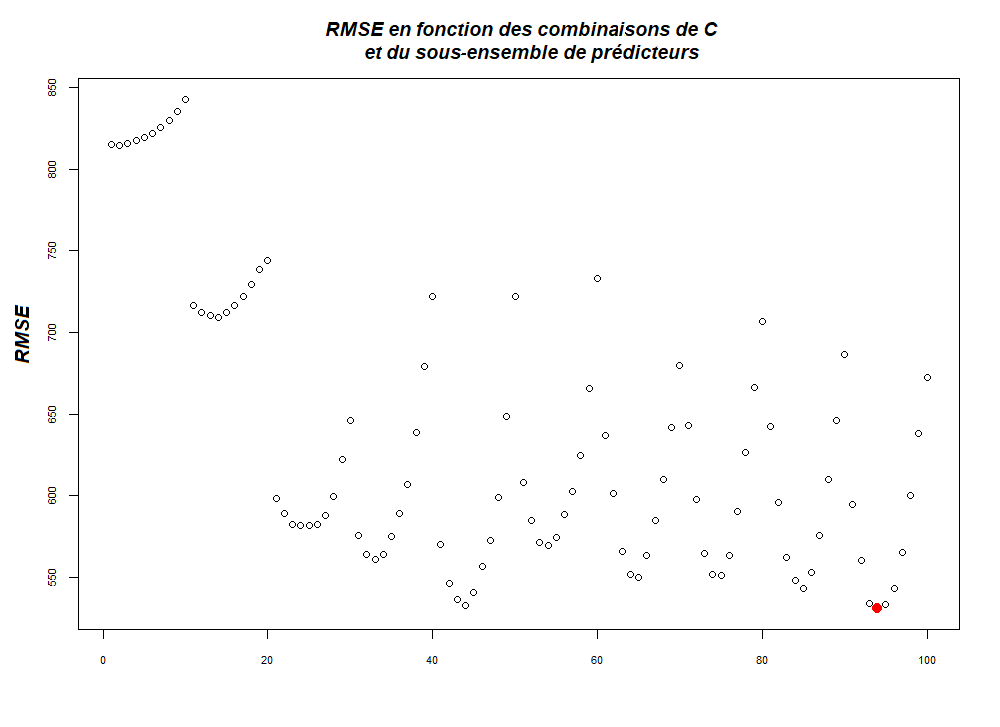

---
output:
  pdf_document: 
    fig_height: 3
    extra_dependencies: ["flafter"]
  html_document: default
---

```{r setup, include=FALSE}
knitr::opts_chunk$set(echo = TRUE)
```

## Analyse  exploratoire

Le fait que les données soient issues d'une seule année ne permet pas de conclure sur l'existance d'éventuelles séries temporelles.

```{r eval=FALSE}
library(corrplot)
matCor <- cor(bike)
corrplot(matCor, type="upper", method ="color" )
```

{width=30%} 

Comme nous pouvions l'imaginer, certaines variables sont fortement corrélées (**temp** et **atemp**,  **season** et **mnth**). 

{width=30%} 

Une ACP confirme l'existance d'un sous ensemble de predicteurs significatifs puisque nous pouvons remarquer que 6 prédicteurs suffisent à expliquer 80% de la variance, et au delà de 6 predicteurs la courbe s'aplatit. Nous pourrions enlever au préalable les varables qui sont manifestement redondantes ou réaliser des prédiction à partir des résultats de l'ACP. Au lieu de cela nous allons laisser le dataset dans l'état et laisser la fonction regsubset selectionner les prédicteurs plus significatifs. 


## Sélection du méilleur modèle
```{r eval=FALSE}
library(leaps)

leaps <- regsubsets(bike$cnt~. , data=bike, method='exhaustive', nvmax=10)
```
{width=40%} 

Grâce au package **leaps** nous réalisons une recherche exhaustive des meilleurs sous ensemble de préditeurs de taille inférieure ou égale à 10. Les critères classiques de séléction du meilleur sous ensemble ne permettent pas de conclure immédiatement quant à la taille optimale du sous ensemble de prédicteur. En raison de la taille modérée du dataset, nous avons opté pour une recherche plus exahaustive. Nous avons réalisé des fonctions permettant de généer du code dynamiquement à l'interieur d'une boucle de façon à tester une série de modèles differents, pour chaque modèle la boucle teste tous les sous enseble de 1 à 10 prédicteurs, et pour chaque sous ensemble de chaque modèle la boucle teste une série de hyperparamètres spécifiques au modèle en question. Pour chaque test nous réalisons aussi une validation croisée avec 5 folds, réeptée 10 fois. A l'issue de cette recherche nous obtenons les performances de chaque modèle testé, dans les conditions optimales (sous ensemble de prédicteurs optimal et hyperparamètres optimaux). La combinatoire est élevée mais en raison de la taille du dataset cette démarche reste réalisable en un temps raisonnable.

```{r eval=FALSE}
get_model_formula <- function(id, object, outcome){
  models <- summary(object)$which[id,-1]
  predictors <- names(which(models == TRUE))
  predictors <- paste(predictors, collapse = "+")
  as.formula(paste0(outcome, "~", predictors))
}
```

La fonction **get_model_formula** permet de générer dynamiquement la formule à injecter dans les modèles. Le package caret permet de réaliser des validations croisées avec un code très compact, ce package permet aussi de tester differentes valeurs des hyperparametres spécifiques aux modèles avec le paramètres tuneLength. Nous réalisons une recherche sur 12 modèles differents, régression linéaire (lm), K plus proches voisins (knn), séparateur à vaste marge avec kernel linéaire, radial et polynomial (svm.line, svm.rad, svm.poly), ridge, lasso, gam, arbre de régression (reg.tree), arbre avec bagging (bag.tree), arbre avec amplification du gradient (boost.tree), forêt aléatoire (rndm.forest).

```{r eval=FALSE}
library(Rcpp)
.
.
library(caret)

model.ids <- 1:10
train.control <- trainControl(method = "repeatedcv", number = 5,  repeats = 10)
models.list <- c("lm", "knn", "svm.line", "svm.rad", "svm.poly","ridge", "lasso",
                 "gam", "bag.tree", "boost.tree", "rndm.forest", "reg.tree")

for(model in models.list)
{
  if(model == "lm")
  {
    get_cv_error <- function(model.formula, data){
      cv <- train(model.formula, data = data, "lm",
                  trControl = train.control)
      cv$results$RMSE
    }
  }
  .
  .
  }
  else if(model == "rndm.forest")
  {
    get_cv_error <- function(model.formula, data){
      cv <- train(model.formula, data = data, "cforest",
                  preProcess = c("center","scale"), 
                  trControl = train.control,
                  tuneLength = 10)
      cv$results$RMSE
    }
  }
  else
  {
    class.model <- NULL
  }
  cv.errors <-  map(model.ids, get_model_formula, models, "cnt") %>%
    map(get_cv_error, data = bike) %>%
    unlist()
  
  models.MSE[model] <- min(cv.errors)^2
}
```

Pour ne pas alourdir la rédaction dans le code ci-dessus nous avons remplacé les partie de code peu pértinent par des "..". Ainsi dans les packages nous avons omis tous les packages nécessaires à l'execution  de chacun des modèles testés (**MASS**, **rpart**, **kernlab**, **gam**,..)Nous avons crée une fonction **get_cv_error** spécifique à chaque modèle qui permet de tenir compte des hyperparamètres et des éventuels traitements spécifiques. Enfin **cv.errors** avec la fonction **map** permet d'appliquer la fonction **get_cv_error** à chaque combinaison de sous ensemble de prédicteurs. Le package **caret** ne permet pas de calculer le MSE directement mais nous pouvons calculer le RMSE et l'évlever au carré pour obtenir le MSE.

{width=50%} 

Le packege **caret** renvoie directement la médiane des erreurs de validation croisée. On peut voir que le modèle qui donne le MSE le plus faible est le svm avec radial kernel. Par contre nous ne savons pas quelle combinaison (nombre de predicteurs et hyperparamètres du modèle) a permis d'obtenir ce resultat. Nous allons donc mener une recherche plus fine sur ce modèle. Voici les résultats obtenus avec les svm radial kernel lors de la recherche du méilleur modèle.

{width=50%}

Dans cette figure nous pouvons observer le processus de recherche. On teste le modèle avec 10 sous ensembles de prédicteurs (de 1 à 10) et pour chaque sous ensemble on teste 10 valeurs du parametre spécifique au modèle dans le cas du svm avec radial kernel c'est le C (cost). On a donc fait 100 cross validations pour aboutir au meilleur paramétrage du modèle. La métrique utilisée est toujours le RMSE. On voit qu'il y a 10 paraboles (une par sous ensemble de predicteurs), chaqune constuée de 10 points (un par valeur de C). La valeur de RMSE la plus faible se trouve sur la 10ème parabole. Cela signifie que ça a été obtenu avec le sous ensemble de 10 prédicteurs (tous les prédicteurs). Le modèle avec 5 prédicteurs permet aussi d'atteindre de performances très intéressantes, les 5 prédicteur en question sont : **season**, **weathersit**, **temp**, **hum** et **windspeed**. Le fait que le méilleur modèle soit celui qui utilise tous les prédicteurs peut être du à l'over fitting. En effet nous avons acces à des données réprésentatives d'une seule année. L'emploi de ce modèle sur des données issues d'autres années permetterait de lever ce doute. Nous retenons le modèle utilisant 5 prédicteurs.
Nous devons maintenant trouver la valeur de l'hyperparamètre C (Cost) qui a permis d'obtenir ce résultat, pour cela nous pouvons utiliser le package **caret** qui encapsule les valeurs optimales dans la variable **$bestTune**. Nous obtenons que la valeur optimale de C est 2. Une validation croisée plus fine, par pas de 0.1 entre 0 et 6, permet d'obtenir **C = 1.5**

{width=40%} 


